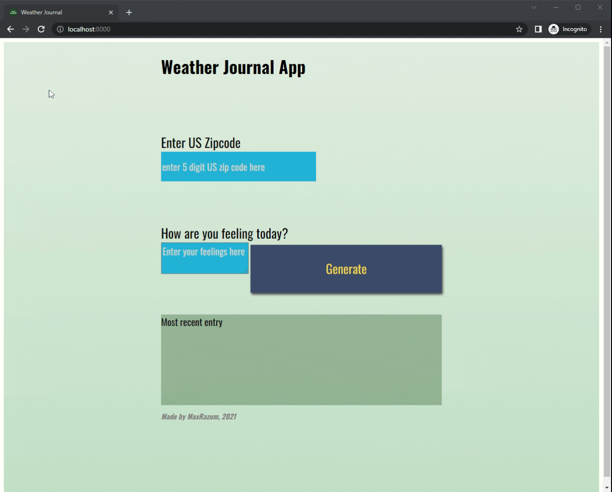

# Weather-Journal App
* This project uses Web API and user data to dynamically update the UI.

### LANGUAGES

    - Javascript
    - HTML
    - SCSS

### Built with

- [Node.js](https://nodejs.org/en/) - Node.js® is a JavaScript runtime built on Chrome's V8 JavaScript engine.
- [Express.js](https://expressjs.com/) - Fast, unopinionated, minimalist web framework for Node.js.

### API
- [One Call API 3.0](https://openweathermap.org/api) - Simple and fast and free weather API from OpenWeatherMap you have access to current weather data.

## Preview

## Instructions

* Install Node.js to run the app locally.
* Run the app with `node server.js` command.
* Navigate to `localhost:8000` in your web browser.