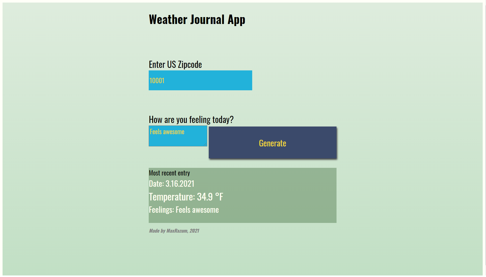

# Front End Web Developer Nanodegree program

## Project three:

* Weather-Journal App

## Original requirements:

* This project requires you to create an asynchronous web app that uses Web API and user data to dynamically update the UI.

## Instructions

* Install Node.js to run the app locally.
* Run the app with `node server.js` command.
* Navigate to `localhost:8000` in your web browser.

## Preview

